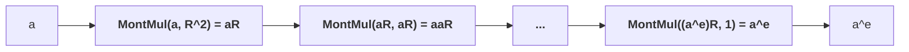

# Montgomery multiplication

*Montgomery form* refers to field elements in the form $aR \mod p$ where $R$ is known as the *Montgomery radix*, which is a power of two, and also larger than and coprime to $p$.

The operation $\mathsf{MontMul}(x, y)$ yields $xyR^{-1}$. Let $x \equiv aR$ and $b \equiv bR$. Applying $\mathsf{MontMul}$ to $x$ and $y$, which are in Montgomery form, will yield $xyR^{-1} \equiv abR$, which is by definition also in Montgomery form. As such, multiple $\mathsf{MontMul}$ operations can be chained.

The key idea is that it is faster to compute the Montgomery multiplication of two values already in Montgomery form than to multiply the original values and then reduce them to the field order. As such, this technique is best used when one has to perform a large number of field multiplications starting out from a relatively small number of input field elements. The most straightforward example of this is naive exponentiation: it is more efficient to use this technique to compute $a^e \mod p$ when $e$ is relatively large compared to the cost of computing $aR$ from $a$ and $a^e$ from $(a^e)R$. (Note that this example is merely illustrative: in practice, it would be more efficient to achieve exponentiation via repeated squaring.)



To illustrate how this would work on the abovementioned example, where one wishes to efficiently compute $y = a^e \mod p$, one would first compute $aR \mod p$ using $\mathsf{MontMul}(a, R^2)$, perform $e$ Montgomery multiplications, and then convert the result out of Montgomery form by computing $\mathsf{MontMul}(a^eR, 1) = a^e$.

$\mathsf{MontMul}$ is a combination of two algorithms: multiplication and reduction. In practice, these algorithms are merged, but to gain intuition about how it works, it is key to first understand how Montgomery reduction works at a high level.

| Symbol | Description | Restrictions |
|-|-|-|
| $p$ | The field modulus. | Must be odd. |
| $x$ | The value to reduce. | $0 \le x \le p^2$ |
| $w$ | The number of bits in a word. | Must fit within a single CPU-native data type, such as a 32 or 64-bit unsigned integer. |
| $n$ | The number of words. | Must be large enough such that $wn$ is equal to or larger than the bit-length of $p$. |
| $R$ | The Montgomery radix. | Coprime to and greater than $p$. Must be a power of 2, usually $2^{wn}$. |
| $\mu$ | The precomputed Montgomery constant. | $-p^{-1} \mod R$, computed using the extended Euclidean algorithm. |

The steps of the reduction algorithm are:

1. $q \leftarrow \mu x\mod R$
2. $c \leftarrow (x + pq) / R$
3. If $c \ge p$ then $c \leftarrow c - p$.
4. Return $c$.

The output is $c \equiv xR^{-1} \mod p$. As long as the input $x$ is equivalent to some $aR \cdot bR$, Montgomery reduction computes $abR \mod p$ as desired.

Essentially, this algorithm adds a multiple of $p$ to $x$ so that the result is a multiple of $R$ and yet equivalent to $x \mod p$. Since dividing by $R$ is efficient, one can thereby arrive at $xR^{-1}$. 

Crucially, we assume that division by $R$ is efficient. In computer processors, this is true as long as $R$ is a power of 2, since said division can be done simply via bitshifts.

Let us break the algorithm down step-by-step.

Substituting $\mu$ in step 1, we know that:

1. $q \equiv -p^{-1}x \mod R$

When we multiply $q$ by $p$ in step 2, the $-p^{-1}$ and $p$ terms cancel each other out, leaving us with $-x \mod R$ in the integer domain. Therefore, $x + pq \equiv x - x$ is divisible by $R$ and equivalent to $x \mod p$.

2. $c \equiv (x - pp^{-1}x) / R \equiv 0 / R \mod R$. Note that $x + p \mu x$, is nonzero $\mod p$, but is a multiple of $R$ as intended.

A final subtraction (step 3) may be applied to bring $c$ to the desired range $0 \le c \lt p$.

A fuller description of the above steps can be found in [*Montgomery Arithmetic from a Software Perspective*](https://eprint.iacr.org/2017/1057.pdf) by Joppe Bos (section 2), including a proof that $(x + pq) / R \le 2p$, so only one conditional subtraction is needed (p4).

Finally, addition and subtraction algorithms work for values in Montgomery form as per usual due to the [distributive law](https://en.wikipedia.org/wiki/Distributive_property), and no special algorithms are needed for them:

$aR + bR = (a + b)R$
$aR - bR = (a - b)R$

# Unoptimised variants

Next, I present variants of Montgomery multiplication algorithms which operate on [multiprecision values](https://en.wikipedia.org/wiki/Arbitrary-precision_arithmetic), also known as big integers. The maximum size of a multiprecision value (e.g. 256 bits) is far greater than the largest available word size in most computer processors (e.g. 64 bits), so multiple limbs are needed.

Each of these methods require the precomputed most significant limb of $p^{-1} \mod R$, also known as $\mu$. It performs the same role as step 1 of the high-level Montgomery multiplication algorithm to cancel out the $p$ term ($q \leftarrow \mu x\mod R$) as described above.

## The Coarsely Integrated Operand Scanning (CIOS) method

Much of the existing work on Montgomery multiplication references Tolga Acar's (and et al) 1996 paper, [*Analyzing and Comparing Montgomery Multiplication Algorithms*](https://www.microsoft.com/en-us/research/wp-content/uploads/1996/01/j37acmon.pdf). It provides line-by-line algorithms and a complexity analysis. Of the five algorithms it describes, the Coarsely Integrated Operand Scanning (CIOS) method is most often implemented, likely due to its relatively lower time and space complexity on general-purpose processors (p11). As its name suggests, the CIOS method performs the multiplication and reduction loops as two inner loops within a single outer loop, and uses less memory than methods which separate these loops.

It is worth noting that researchers at the gnark team at ConsenSys made [a further optimisation to CIOS](https://hackmd.io/@gnark/modular_multiplication) which applies if the most significant limb of $p$ meets certain conditions.

## The Finely Integrated Operand Scanning (FIOS) method

Acar's paper also introduces the Finely Integrated Operand Scanning (FIOS) method (p7), which has just one inner loop for multiplication and reduction. Some optimised variants of Montgomery algorithms use it without explicitly mentioning its name; Mitscha-Baude, for instance, refers to it as the "iterative algorithm", while Bos (2017) presents a version of it but does not identify its origin.

# Optimised variants

## Bos' method

[*Montgomery Multiplication from a Software Perspective*](https://eprint.iacr.org/2017/1057.pdf) (2017) by Joppe Bos provides a version of the Montgomery multiplication algorithm that is suitable for SIMD-enabled processors. [Single Instruction, Multiple Data](https://en.wikipedia.org/wiki/Single_instruction,_multiple_data) (SIMD) refers to CPU operations which apply to multiple pieces of concatenated data, such as addition of pairs of 64-bit values in a single opcode.

For instance: `simd_add(a0a1, b0b1) = c0c1` where `c0 = a0 + b0` and `c1 = a1 + b1`, and `a0a1`, `b0b1`, and `c0c1` are SIMD vector types which can be thought of as simply the concatenation of 32 or 64-bit variables.

Bos adapts the FIOS method to use two-way SIMD instructions, thereby achieving the same computation with fewer steps. It is important to note that this is not the same as multi-threading, even though Bos illustrates the SIMD-enabled algorithm as two separate computations (p16).

While this technique may be faster than its non-SIMD counterparts on processors with SIMD support (such as those which support SSE2; see this implementation in C for ChromeOS firmware found in the [vboot repository](https://github.com/coreboot/vboot/blob/main/firmware/2lib/2modpow_sse2.c)), it is, unfortunately, currently not suitable for WASM in the browser. This is because it requires certain SIMD opcodes (such as unsigned 64-bit x 2 multiplication or addition) which browsers do not execute using native CPU SIMD instructions. Rather, they unpack these variables, use non-SIMD instructions underneath, and then repack them, leading to unnecessary overhead. 

## Emmart's method

Niall Emmart's submission to ZPrize 2023 contains a Montgomery multiplication algorithm mostly based on the `f64x2_relaxed_madd` relaxed SIMD WASM opcode. Each field element is an array of [64-bit floating point variables](https://en.wikipedia.org/wiki/Double-precision_floating-point_format). Each mantissa of these values holds a 51-bit limb. This technique draws upon his paper [*Faster Modular Exponentiation Using Double Precision Floating Point Arithmetic on the GPU*](https://ieeexplore.ieee.org/document/8464792/) (EZW18) but uses 51 instead of 52 bits per limb as the developer cannot control the opcode's rounding mode.

As mentioned earlier, web browsers[ only translate some WASM SIMD instructions into native SIMD instructions](https://emscripten.org/docs/porting/simd.html#optimization-considerations). As such, Emmart's method outperforms Bos's method described above. As will be discussed below, however, Emmart's also uses the `i64x2_add` SIMD instruction, which unfortunately leads to some performance loss.

### Prerequisites

The key building block of Emmart's method is how it computes the product of two 51-bit limbs $a$ and $b$. The result is two 51-bit values: a high term and a low term ($\mathsf{hi}$ and $\mathsf{lo}$).

$a \cdot b = (\mathsf{hi}, \mathsf{lo})$

Each limb and term are stored in an 64-bit floating point data type defined by the [IEEE-754](https://en.wikipedia.org/wiki/IEEE_754) standard (which I will refer to as `f64`s).

Emmart's method requires the following operations on `f64` values. In WASM, the developer does not have control over the rounding mode of any of these operations.

- `mul_add`: [Fused multiply-and-add](https://en.wikipedia.org/wiki/Multiply%E2%80%93accumulate_operation). This first performs multiplication occurs with infinite precision, and then addition with rounding.
- `-`: Subtraction.
- `f64::to_bits()`: Conversion to IEEE-754 formatted bits. This is to directly map an `f64` to a 64-bit unsigned integer. 

By the IEEE-754 standard, 64-bit floating-point values have the following bit layout:

```
[1-bit sign][11-bit exponent][52-bit mantissa]
```

The exponent has a bias of 1023; that is, to obtain its absolute value, subtract 1023.

For clarity, I will use this format to display `f64`s: `(sign, unbiased exponent, mantissa in hex)`. For example, the `f64` `(0, 103, 0A8C3F0EB9985)` is positive because its sign bit is 0, has an exponent of 103, and has a mantissa of `0x0A8C3F0EB9985`.

### The algorithm

First, let us define some constants:

- `c1` is a `f64` with the value $2^{103}$.
    - In our format, it is: `(0, 103, 0x0000000000000)`.
    - In hexadecimal, it is `0x4660000000000000`.
- `c2` is a `f64` with the value $2^{103} + 3 * 2^{51}$.
    - In our format, it is: `(0, 103, 0x0000000000003)`.
    - In hexadecimal, it is `0x4660000000000003`.

Next, compute the floating points `hi`, `sub`, and `lo`:

```rust
let mut hi = a.mul_add(b, c1);
let sub = c2 - hi;
let mut lo = a.mul_add(b, sub);
```

Next, we subtract `c1.to_bits()` from `hi.to_bits()`, effectively applying a bitmask. This approach allows multiple product terms to be summed, followed by a single subtraction, rather than applying a bitmask each time a product is computed (EZW18 p131).

```rust
let mut hi = hi.to_bits() - c1.to_bits();
```

Finally, we perform a conditional subtraction on the high bits, mask the low bits, and return the results.

```rust
let lo = lo.to_bits() & mask;
// If the lower word is negative, subtract 1 from the higher word
if lo & 0x4000000000000u64 > 0 {
    hi -= 1;
}

return (hi, lo);
```

Also note that this subtraction may be omitted if the multiprecision arithmetic algorithm you use performs carry propagation.

### Explanation

When we perform:

```rust
let mut hi = a.mul_add(b, c1);
```

What occurs behind the scenes is:

1. Computation of `a * b` with infinite precision, which will have an exponent of at most `51 * 2 = 102`.
2. Addition of `c1 = (0, 103, 0x0000000000000)` to `a * b`, which forces the result to have an exponent of 103, and preserving bits 52-103 in the the 52-bit mantissa.
3. During the addition step, the result is rounded up if the 52nd bit is 1, and not rounded if it is 0.

Let's visualise this with example values `a = 1596695558896492` and `b = 1049164860932151`.

The binary representation of the full (non-floating-point) product of `a * b + c1` is:

``` 
╭╴ 104th bit
10010101001001001101... 10110 101111110101001101101...10100
 ╰─ The higher 52 bits  ────╯ ╰─ The lower 51 bits    ────╯
                              ╰─ The rounding bit
```

Compare the above with the binary representation of the mantissa of the floating-point value `hi = a.mul_add(b, c1)`:

```
01000110011000111101110101100010110110...11 
│╰─ e=103──╯╰── mantissa (rounded up) ────╯ 
╰╴ Sign (positive)                     52 ╯
```

Observe that the mantissa of `hi` is greater by 1 (`...10` vs `...11`). This is because the CPU rounds this floating point value up as the 51st bit is 1.

Next, to understand how we get the lower 52 bits, let us expand the computation of `sub` and `lo`:

```rust 
let sub = c2 - hi;
let mut lo = a.mul_add(b, sub); 
```

`sub` is negative, and contains the high bits. Adding `sub` to `a * b` zeros out the high bits, forces the exponent to 52, and leaves us with the lower 52 bits.

```
(a * b) + sub                     =
(a * b) + (c2              ) - hi =
(a * b) + (2^103 + 3 * 2^51) - hi
   │             │           ╰─ Subtracts the high bits and 2^103 from c2
   │             ╰─ Sets the exponent of the result to 52, and sets bit 52 to 1
   ╰─ Computes a * b with full precision (102 bits)
```

Observe that `c2` (which is `2^103 + 3 * 2^51`) forces the result to have an exponent of 52. This is because the binary representation of `c2` as a floating-point is:

```
0100011001100000000000...00011
 ╰─e=103───╯╰─ 52 bits   ────╯
```

No matter what value `hi` has, since the bits for $2^{52}$ and $2^{53}$ are set, the result will be at least $2^{52}$, which forces the mantissa to retain the lower 51 bits.

Finally, we subtract 1 from `hi` if the 51st (leftmost) bit of `lo` is 1, and apply a bitmask to `lo` to ensure that we only have the lower 51 bits.

### Finite Field Implementation 

Next, Emmart's method incorporates the abovementioned FMA-based limb product algorithm into CIOS Montgomery multiplication. This can be seen in his `fieldPairMul()` code in [FieldPair.c](https://github.com/z-prize/2023-entries/blob/main/prize-2-msm-wasm/prize-2b-twisted-edwards/yrrid-snarkify/yrrid/FieldPair.c). The implementation references algorithm 9 in EZW18, but works in a single thread.

Another optimisation that Emmart's method is that it deliberately decouples carry propagation and conditional subtraction from `fieldPairMul()`. Rather, carries can be resolved by the parent function by calling [`fieldPairResolve()`](https://github.com/z-prize/2023-entries/blob/main/prize-2-msm-wasm/prize-2b-twisted-edwards/yrrid-snarkify/yrrid/FieldPair.c#L111). Additionally, the parent function is responsible for invoking either `fieldPairReduce()` (which can reduce a big integer between $0$ and $6p$ to modulo $p$, albeit with some exceptions), or `fieldPairFullReduceResolve()` which ensures that a reduction is performed.

The reason for decoupling the reduction and carry propagation is to optimise elliptic curve operations, which involve a series of multiprecision arithmetic operations. By performing a conditional subtraction only after some number of field multiplications, rather than after every single one, less computation is required. The exact number of field multiplications that can be performed before a reduction should be determined by hand, depending on the particular steps which comprise the elliptic curve operation in question.

## Mitscha-Baude's method

Gregor Mitscha-Baude's submission to ZPrize 2022 uses reduced-radix big integer representation (29 or 30 bits), along with a custom Montgomery multiplication algorithm that minimises bitshifts. This allows his code to outperform the classic CIOS method which uses 32-bit limbs. He provides a full description of his method in his [`montgomery`
repository](https://github.com/mitschabaude/montgomery/blob/main/doc/zprize22.md#13-x-30-bit-multiplication).

His key insight is that 32-bit limbs require a carry after every product (e.g. $a_i * b_j$), which involves an addition, a bitwise AND, and a bitshift. If, however, smaller limbs are used, multiple products can be done without carries. A further minor optimisation is that based on the limb size, some conditional branches can be omitted from Mitscha-Baude's algorithm.

# Benchmarks and discussion

The following benchmarks were made on a 13th Gen Intel(R) Core(TM) i7-13700HX laptop running the following algorithm, which executes `cost` Montgomery multiplications. Since each loop iteration depends on the previous one, the multiplications run in serial.

```rs
fn expensive_function(ar, br, p, n0, cost) {
    x = a
    y = b
    for _ in 0..cost {
        z = mont_mul(x, y, p, n0)
        x = y
        y = z
    }
    return y
}
```

The code being benchmarked was written in C and compiled to WASM using Emscripten. It can be found in the [`clientside` repository](https://github.com/weijiekoh/clientside/).

The following versions of Montgomery multiplication were benchmarked:

- CIOS from Bos (2017), without SIMD opcodes
- CIOS from Bos (2017), with SIMD opcodes
- CIOS from Acar (1996)
- CIOS with Emmart's method
- Mitscha-Baude's method (29-bit limbs)
- Mitscha-Baude's method (30-bit limbs)

For $2^{20}$ Montgomery multiplications, the performance was:

| Method | Time taken (ms) |
|-|-|
| Bos (2017) without SIMD | 76 |
| Bos (2017) with SIMD | 110 |
| Acar (1996) | 73 |
| Emmart's method | 20 |
| Mitscha-Baude's method (29-bit limbs) | 13.8 |
| Mitscha-Baude's method (30-bit limbs) | 13.9 |

For $2^{16}$ Montgomery multiplications, the performance was:

| Method | Time taken (ms) |
|-|-|
| Bos (2017) without SIMD | 4.9 |
| Bos (2017) with SIMD | 6.9 |
| Acar (1996) | 4.6 |
| Emmart's method | 1.2 |
| Mitscha-Baude's method (29-bit limbs) | 0.9 |
| Mitscha-Baude's method (30-bit limbs) | 0.9 |

Note that Bos' method with SIMD instructions is significantly slower than the equivalent version without SIMD instructions, as NodeJS does not natively execute the WASM SIMD operations it uses, such as `i64x2_add`. As such, it suffers from the performance cost of unpacking and repacking SIMD vector data. Emmart's method, while relatively faster, also suffers from this issue. Although it relies on FMA SIMD instructions which browsers and NodeJS execute natively, it also uses the 2x64-bit addition SIMD instruction, which they emulate at a cost.

# Implications and future work

Since web browsers today only support a small set of SIMD opcodes without unpacking them, and benchmarks show that Mitscha-Baude's non-SIMD reduced-radix method outperforms the SIMD-based methods anyway, it is worthwhile to just use Mitscha-Baude's method. If browsers someday support all SIMD opcodes that Bos and Emmart use without unpacking SIMD vector data, it may then be worthwhile to adopt those methods.

Furthermore, it is possible that not all consumer devices support the FMA SIMD opcode. To ensure compatibility with as many devices as possible, Mitscha-Baude's method is preferable.

Conversely, for consumer devices which do support the `i64x2_add` opcode (and others like it), and in applications which do not run in WASM, Emmart's or Bos' methods may be faster. For example, a native Android or iOS app could take advantage of such SIMD opcodes for greater effect. More analysis and benchmarks are needed to validate this hypothesis.
