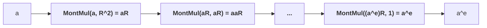

# Montgomery multiplication

When one has to perform a large number of field multiplications starting out
from a relatively small number of input field elements, it is much more
efficient to use Montgomery modular multiplication than to perform regular
multiplication and modular reduction at each step.

Montgomery modular multiplication operates on inputs which are already in
*Montgomery form* (i.e. $aR$ and $bR \mod p$ where $p$ and $R$ are coprime),
and outputs $abR \mod p$). $a$, $b$, and $p$ are multiprecision values, also
known as big integers, with $n$ limbs of at most $w$ bits. In code, each
$w$-bit limb is typically stored in a 32 or 64-bit unsigned integer or
floating-point data type. $R$ is typically $2^{wn}$, and must be coprime to
$p$.



To illustrate how this would work on the abovementioned exponentiation example,
where we wish to efficiently compute $y = a^e \mod p$, we would first compute
$aR \mod p$ (using $\mathsf{MontMul(a, R^2)}$), perform $e$ Montgomery
multiplications, and then convert the result $y$ out of Montgomery form by
computing $\mathsf{MontMul}(a^eR, 1) = a^e$.

$\mathsf{MontMul}$ is a combination of two algorithms: multiplication and
reduction. In practice, these algorithms are merged, but in gain intuition
about how it works, it is key to understand how Montgomery reduction works.

The Montgomery reduction algorithm is as follows:

| Symbol | Description | Restrictions |
|-|-|-|
| $p$ | The field modulus. | Must be odd. |
| $x$ | The value to reduce. | $0 \le x \le p^2$ |
| $R$ | The Montgomery radix. | Coprime to and greater than $p$. Must be a power of 2, usually $2^{wn}$, where $wn$ is the limb size multiplied by the number of limbs. |
| $\mu$ | The precomputed Montgomery constant. | $-p^{-1} \mod R$, computed using the extended Euclidian algorithm. |

The output is $c \equiv xR^{-1} \mod p$. As long as the input $x \equiv aR *
bR$, Montgomery reduction computes $abR \mod p$ as desired.

Crucially, we assume that division by $R$ is efficient. In computer processors,
this is true as long as $R$ is a power of 2, since said division can be done
simply via bitshifts.

The steps of the algorithm are:

1. $q \leftarrow \mu x\mod R$
2. $c \leftarrow (x + pq) / R$
3. If $c \ge p$ then $c \leftarrow c - p$.
4. Return $c$.

Substituting $\mu$ in step 1, we have $q \leftarrow -p^{-1}x$. When we multiply
$q$ by $p$ in step 2, the $-p^{-1}$ and $p$ terms cancel each other out,
leaving us with some nonzero value equivalent to $x \mod R$ in the integer
domain. Next, dividing by $R$ is equivalent to multiplying by $R^{-1}$, giving
us our result $c = xR^{-1}$. A final subtraction (step 3) may be needed to
bring $c$ to the desired range $0 \le c \lt p$.

Addition and subtraction of values in Montgomery form work as per usual due to
the [distributive law](https://en.wikipedia.org/wiki/Distributive_property):

$aR + bR = (a + b)R$
$aR - bR = (a - b)R$

A fuller description of the above steps can be found in [*Montgomery Arithmetic
from a Software Perspective*](https://eprint.iacr.org/2017/1057.pdf) by Joppe
Bos (section 2), including a proof that only one conditional subtraction is
needed (p4).

There are several variants of the Montgomery modular multiplication algorithm,
and they perform differently depending on the platform. Since we target WASM in
the browser, we will focus on those which are most suitable for it. We will
cover:

- **Emmart's method**: using 64-bit floating point variables and single
  instruction, multiple data (SIMD) opcodes.
- **Mitscha-Baude's method**: using 64-bit unsigned integers to store
  reduced-radix limbs, namely 29 or 30-bit limbs. This method can also be
  adapted to work in in 32-bit environments for 13-bit limbs, [such as
  WebGPU](https://github.com/td-kwj-zp2023/webgpu-msm-bls12-377/blob/bls12_377/README.md#montgomery-multiplication).


## Existing literature

Before we describe these methods, we encourage the reader to review existing
work on Montgomery multiplication.

### Peter Montgomery's original paper

[*Modular Multiplication Without Trial
Division*](https://www.ams.org/journals/mcom/1985-44-170/S0025-5718-1985-0777282-X/S0025-5718-1985-0777282-X.pdf)
(1985) is the seminal paper introducing Montgomery reduction. 

### Tolga Acar's thesis

[*Analyzing and Comparing Montgomery Multiplication
Algorithms*](https://www.microsoft.com/en-us/research/wp-content/uploads/1996/01/j37acmon.pdf)
(1996) by Tolga Acar, et al, provides line-by-line algorithms for Montgomery
multiplications, along with a complexity analysis. Of the five algorithms it
describes, the Coarsely Integrated Operand Scanning (CIOS) method is most often
implemented, likely due to its relatively lower time and space complexity.

The Separated Operand Scanning (SOS) method, however, should be considered as a
potentially more performant Montgomery squaring algorithm, even if it requires
more space to store the intermediate results. Since it performs the
multiplication before reduction, about half of of the term multiplications can
be skipped (p6). More benchmarks are needed to validate this claim.

Each of these methods require the precomputed most significant limb of $p^{-1}
\mod R$, sometimes referred to as $\mu$ or $n0$. It performs the same role as
step 1 of the high-level Montgomery multiplication algorithm to cancel out the
$p$ term ($q \leftarrow \mu x\mod R$) as described above, except that it
operates in the multiprecision context.

[*Montgomery Multiplication from a Software
Perspective*](https://eprint.iacr.org/2017/1057.pdf) (2017) by Joppe Bos
provides a version of the Montgomery multiplication algorithm that is suitable
for SIMD-enabled processors. An implementation in C for ChromeOS firmware can
be found in the [vboot
repository](https://github.com/coreboot/vboot/blob/main/firmware/2lib/2modpow_sse2.c).
It is, unfortunately, not suitable for WASM in the browser, as it requires
certain SIMD opcodes (such as unsigned 64-bit x 2 multiplication) which
browsers do not execute using native CPU SIMD instructions. Rather, they unpack
these variables and repack them, leading to unnecessary overhead. This is in
contrast to Emmart's method, which uses 64-bit x 2 floating-point
multiply-and-add (FMA) SIMD instructions, which *do* get natively executed
under the hood. 

## Emmart's method

Niall Emmart's submission to ZPrize 2023 contains a Montgomery multiplication
algorithm based on the `f64x2_relaxed_madd` relaxed SIMD WASM opcode. Each
field element is an arrays of [64-bit floating point
variables](https://en.wikipedia.org/wiki/Double-precision_floating-point_format).
Each mantissa of these values holds a 51-bit limb. This technique draws upon
his paper [*Faster Modular Exponentiation Using Double Precision Floating Point
Arithmetic on the GPU*](https://ieeexplore.ieee.org/document/8464792/) (EZW18)
but uses 51 instead of 52 bits per limb as the developer cannot control the
opcode's rounding mode.

As mentioned earlier, web browsers only translate some WASM SIMD instructions
(see https://emscripten.org/docs/porting/simd.html#optimization-considerations)
into native SIMD opcodes. As such, Emmart's method outperforms the
corresponding algorithm by Bos (2017) mentioned above.

### Prerequisites

The key building block of Emmart's method is how it computes the product of two
51-bit limbs $a$ and $b$. The result are two 51-bit values: a high term and a
low term ($\mathsf{hi}$ and $\mathsf{lo}$).

$a \cdot b = (\mathsf{hi}, \mathsf{lo})$

Each limb and term are stored in an 64-bit floating point data type defined by
the IEEE-754 standard (which we will refer to as `f64`s).

Required operations on `f64`s are as follows. Note that we do not assume that
the developer has control over the rounding mode of any of these operations
(although EZW18 uses a FMA operation `__fma_rz` which always rounds to zero).

- `mul_add`: Fused multiply and add, such as the `mul_add` function in Rust, or
  `__fma_rz` function in CUDA. We assume that the multiplication occurs with
  infinite precision, and that rounding occurs at the addition step.
- `-`: Subtraction.
- `to_u64()` or `f64::to_bits()`: Conversion to IEEE-754 formatted bits. In C,
  one can use a `memcpy` to do this conversion.

By the IEEE-754 standard, 64-bit floating-point values have the following bit
layout:

```
[1-bit sign][11-bit exponent][52-bit mantissa]
```

The exponent has a bias of 1023 (to obtain its absolute value, subtract 1023).

For clarity, we will use this format to display `f64`s: `(sign, unbiased
exponent, mantissa in hex)`. For example, the `f64` `(0, 103, 0A8C3F0EB9985)`
is positive because its sign bit is 0, has an exponent of `1126 - 1023 = 103`,
and has a mantissa of `0x0A8C3F0EB9985`.

### The algorithm

First, we define some constants:

- `c1` is a `f64` with the value $2^{103}$.
    - In our format, it is: `(0, 103, 0x0000000000000)`.
    - In hexadecimal, it is `0x4660000000000000`.
- `c2` is a `f64` with the value $2^{103} + 3 * 2^{51}$.
    - In our format, it is: `(0, 103, 0x0000000000003)`.
    - In hexadecimal, it is `0x4660000000000003`.

Next, we compute the floating points `hi`, `sub`, and `lo`:

```rust!
let mut hi = a.mul_add(b, c1);
let sub = c2 - hi;
let mut lo = a.mul_add(b, sub);
```

Next, we subtract `c1` from `to_u64(hi)`. This is effectively the same as
applying a bitmask, but allows for a large number of product terms to be summed
and then a single subtraction to be performed, instead of applying a bitmask
every time we compute a product (EZW18 p131).

```rust!
let mut hi = hi.to_bits() - c1.to_bits();
```

Finally, we perform a conditional subtraction on the high bits, mask the low bits, and return the results.

```rust!
let lo = lo.to_bits() & mask;
// If the lower word is negative, subtract 1 from the higher word
if lo & 0x4000000000000u64 > 0 {
    hi -= 1;
}

return (hi, lo);
```

Also note that this subtraction may be omitted if the multiprecision arithmetic
algorithm you use performs carry propagation.

### Explanation

When we perform:

```rust let mut hi = a.mul_add(b, c1); ```

What occurs behind the scenes is:

1. Computation of `a * b` with infinite precision, which will have an exponent
   of at most 51 * 2 = 102.
2. Addition of `c1 = (0, 103, 0x0000000000000)` to `a * b`, which forces the
   result to have an exponent of 103, and a 52-bit mantissa of bits 52-103.
3. During the addition step, the result is rounded up if the 51st bit is 1, and
   not rounded up if it is 0.

Let's visualise this with example values `a = 1596695558896492` and `b =
1049164860932151`.

The binary representation of the full (non-floating-point) product of `a * b +
c1` is:

```rust ╭╴ 104 10011110111010110001...10111011010010101001...1 ╰─ The top 52
bits ────╯╰── Lower 51 bits ───╯ ╰─ The rounding bit (51) ```

Compare the above with the binary representation of the mantissa of the
floating-point value `hi = a.mul_add(b, c1)`:

```rust 01000110011000111101110101100010110110...11 │╰─ e=103──╯╰── mantissa
(rounded up) ────╯ ╰╴ Sign (positive)                     52 ╯ ```

Observe that the mantissa of `hi` is greater by 1. This is because the CPU
rounds this floating point value up as the 51st bit is 1.

To understand how we get the lower 52 bits, let us expand the computation of
`sub` and `lo`:

```rust let sub = c2 - hi; let mut lo = a.mul_add(b, sub); ```

`sub` is negative, and contains the high bits. Subtracting `sub` from `a * b`
zeros out the high bits, forces the exponent to 52, and leaves us with the
lower 52 bits.

```
(a * b) + sub                     =
(a * b) + (c2              ) - hi =
(a * b) + (2^103 + 3 * 2^51) - hi
   │             │           ╰─ Subtracts the high bits and 2^103 from c2
   │             ╰─ Sets the exponent of the result to 52, and sets bit 52 to 1
   ╰─ Computes a * b with full precision (102 bits)
```

All that is left is to subtract 1 from `hi` if the leftmost (51st) bit of `lo`
is 1, and apply a bitmask to `lo` to ensure that we only have the lower 51
bits. 

### Finite Field Implementation 

Next, Emmart's method incorporates the abovementioned FMA-based limb product
algorithm into CIOS Montgomery multiplication. This can be seen in his
`fieldPairMul()` code in
[FieldPair.c](https://github.com/z-prize/2023-entries/blob/main/prize-2-msm-wasm/prize-2b-twisted-edwards/yrrid-snarkify/yrrid/FieldPair.c).
The implementation references **algorithm 9** in
[EZW18](https://ieeexplore.ieee.org/document/8464792/), but works in a single
thread.

To understand how it works, read it along with the following notes:

- **Extracting high and low terms**: The constants `c0` to `c4` are used to
  extract the high and low terms, as described above.
- **Hardcoded modulus**: The limbs of $p$ are hardcoded in `p[]`.
- **Initial values of `sum[]`**: As described in EZW18 (p133), the initial
  values of the `sum` array are carefully constructed so that they get
  cancelled out by the first 12 bits of each term accumulated by the CIOS
  algorithm.
- **Lack of carry propagation or a final conditional subtraction**:
  `fieldPairMul()` does not perform carry propagation, but carries can be
  resolved by the parent function by calling
  [`fieldPairResolve()`](https://github.com/z-prize/2023-entries/blob/main/prize-2-msm-wasm/prize-2b-twisted-edwards/yrrid-snarkify/yrrid/FieldPair.c#L111).
  Additionally,`fieldPairMul()` does not perform a conditional subtraction;
  rather, the parent function is responsible for invoking either
  `fieldPairReduce()` (which can reduce a big integer between $0$ and $6p$ to
  modulo $p$, albeit with some exceptions), or `fieldPairFullReduceResolve()`
  which ensures that a reduction is performed. The reason for unbundling the
  reduction and carry propagation is to optimise elliptic curve operations, by
  performing a conditional subtraction after some number of field
  multiplications, rather than after every single one.

## Mitscha-Baude's method

Gregor Mitscha-Baude's submission to ZPrize 2022 uses reduced-radix big integer
representation (29 or 30 bits), along with a custom Montgomery multiplication
algorithm that minimises bitshifts. This allows his code to outperform the
classic CIOS method which uses 32-bit limbs. He provides a full description of
his method in his [`montgomery`
repository](https://github.com/mitschabaude/montgomery/blob/main/doc/zprize22.md#13-x-30-bit-multiplication).

The key insight is that 32-bit limbs require a carry after every product, which
involves an addition, a bitwise AND, and a bitshift. If, however, smaller limbs
are used, multiple products can be done without carries. For 29-bit limbs, that
number is 64, and 16 for 30-bit limbs. A further minor optimisation is that
based on the limb size, some conditional branches can be omitted from
Mitscha-Baude's algorithm.

## Benchmarks

The following benchmarks were made on a 13th Gen Intel(R) Core(TM) i7-13700HX
laptop running the following algorithm, which executes `cost` Montgomery
multiplications. Since each loop iteration depends on the previous one, the
multiplications run in serial.

```rs
fn expensive_function(ar, br, p, n0, cost){
    x = a
    y = b
    for _ in 0..cost {
        z = mont_mul(x, y, p, n0)
        x = y
        y = z
    }
    return y
}
```

The coded being benchmarked was written in C and compiled to WASM using
Emscripten. It lives in the [`clientside`
repository](https://github.com/weijiekoh/clientside/).

The following versions of Montgomery multiplication were benchmarked:

- CIOS from Bos (2017), without SIMD opcodes
- CIOS from Bos (2017), with SIMD opcodes
- CIOS from Acar (1996)
- CIOS with Emmart's method
- Mitscha-Baude's method (29-bit limbs)
- Mitscha-Baude's method (30-bit limbs)

For $2^{20}$ Montgomery multiplications, the performance was:

| Method | Time taken (ms) |
|-|-|
| Bos (2017) without SIMD | 76 |
| Bos (2017) with SIMD | 110 |
| Acar (1996) | 73 |
| Emmart's method | 20 |
| Mitscha-Baude's method (29-bit limbs) | 13.8 |
| Mitscha-Baude's method (30-bit limbs) | 13.9 |

For $2^{16}$ Montgomery multiplications, the performance was:

| Method | Time taken (ms) |
|-|-|
| Bos (2017) without SIMD | 4.9 |
| Bos (2017) with SIMD | 6.9 |
| Acar (1996) | 4.6 |
| Emmart's method | 1.2 |
| Mitscha-Baude's method (29-bit limbs) | 0.9 |
| Mitscha-Baude's method (30-bit limbs) | 0.9 |

Note that Bos' method with SIMD instructions is significantly slower than the
equivalent version without SIMD instructions, while Mitscha-Baude's method was
faster than Emmart's.

These benchmarks should not be taken as definitive because more work should be
done to further optimise them. At the time of writing, inline assembly was not
used, although a future version of these benchmarks should do so.
